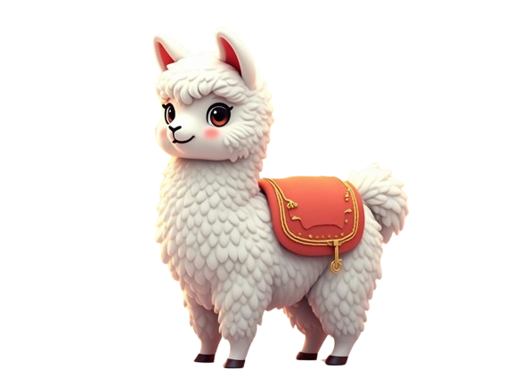

  

This is an implementation of [LLaMA](https://arxiv.org/abs/2302.13971) scaled down to a ≈ 100M parameters approx (comparable to `gpt-2`). Except for the tokenizer, everything has been coded out using torch . I also train the model on WikiText-103. 